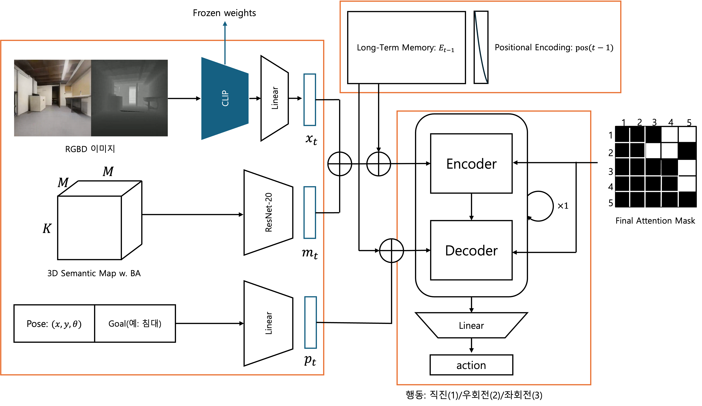
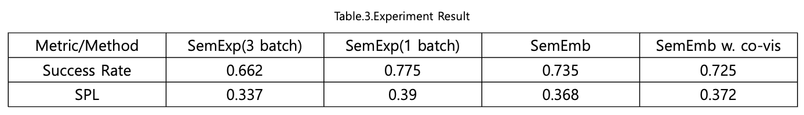

# SemEmb: KHU Robot-Vision Capstone Design Project
-----
This repository is for Robot Vision Capstone Design Project in KyungHee Univ. 2024 spring semester  
Our model's Architecture is like:  
 <br />

This repository contains:
- SemEmb train & evaluation code
- Docker file for SemEmb and Habitat simulations 

## Ideas
-----

Our team's main contribution is like:  
- Long-Term Embedding vector memory for robust transformer navigation policy
- co-visible attention mask to compensate the information loss from compression

## Experiments
-----

Our experiment result seems like overwhelming SemExp. However, our simulation made unstable results with respect to the batch size.  
Model’s performance was reduced with larger batch size. We can not figure the reason why evaluation metrics shrinks in larger batch size.  
So, we can not convince that our model gets better performance than SemExp. We think that additional study is needed.  

 <br />

## Conclusion
-----

From the experiment result, we can not convince that our contribution works better than the existing works.   
Although our experiments failed, we can find other possibilities to enhance the performance and contribute to the research domain in Embodied QA.  
Our further work may be:  
- Review the SemExp and Habitat Simulator code to figure out the malfunction in evaluations
- Train SemEmb with larger GPU and extend SemEmb to larger model size
- Propose another novelties in order to get better performance
- Extend our model to another dataset like MP3D or other simulators


## Install dependencies with Docker 
-----

To install dependencies for SemEmb, we can use docker.

1. Build Docker image (docker image tag for $version): 

```
bash buid_dimage.sh $version
```

2. run docker container:

```
bash run_docker_con.sh
```

After run docker container, you can access container with command below:

```
sudo nvidia-docker exec -it <container name> /bin/bash
```


## Training
-----

To train & evaluate SemEmb, you can use following scripts

- Train

```
CUDA_VISIBLE_DEVICES=0,1 python3 train.py -n 1 --auto_gpu_config=0 --num_global_steps=5 --num_mini_batch=3 --exp_name=<experiment name>
```

Arguments descriptions:  
- n: number of process for Habitat simulator (batch size)
- auto_gpu_config: turn on/off GPU auto configuration (0 for off, 1 for on)
- num_global_steps: Number of timesteps for transformer
- num_mini_batch: PPO's minibatch size
- exp_name: experiment tag (result will be saved in following path)

- Evaluation

```
CUDA_VISIBLE_DEVICES=0 python3 train.py --split val --eval 1 --load <checkpoint path> -n 1 --auto_gpu_config=0
```

Argument descriptions:  
- split: dataset type(train/validation)
- eval: turn on the evaluation mode
- load: mode checkpoint path
- n: number of process for Habitat simulator (batch size)
- auto_gpu_config: turn on/off GPU auto configuration (0 for off, 1 for on)

## Database setup
-----

We use gibson dataset for this study. Gibson dataset is avaliable in the [link](https://github.com/facebookresearch/habitat-lab#scenes-datasets).  
Download the Gibson dataset using the instructions in the link.

- Setting up datasets

The code requires the datasets in a specific folder in the following format (same as habitat-lab):  

```
data/
  scene_datasets/
    gibson_semantic/
      Adrian.glb
      Adrian.navmesh
      ...
  datasets/
    objectnav/
      gibson/
        v1.1/
          train/
          val/
```

You can set the dataset path for 'data' directory with docker container volume mount.

## Related Projects
- This project builds on the [Active Neural SLAM](https://devendrachaplot.github.io/projects/Neural-SLAM) paper. The code and pretrained models for the Active Neural SLAM system are available at:
https://github.com/devendrachaplot/Neural-SLAM.
- The Semantic Mapping module is similar to the one used in [Semantic Curiosity](https://devendrachaplot.github.io/projects/SemanticCuriosity).

## Acknowledgements
This repository uses [Habitat Lab](https://github.com/facebookresearch/habitat-lab) implementation for running the RL environment.
The implementation of PPO is borrowed from [ikostrikov/pytorch-a2c-ppo-acktr-gail](https://github.com/ikostrikov/pytorch-a2c-ppo-acktr-gail/). 
The Mask-RCNN implementation is based on the [detectron2](https://github.com/facebookresearch/detectron2/) repository. We would also like to thank Shubham Tulsiani and Saurabh Gupta for their help in implementing some parts of the code.
